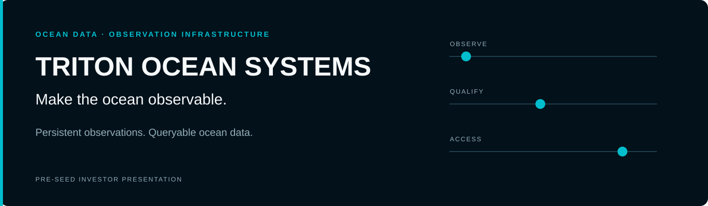

<div align="center">



[](Triton_PreSeed_Deck_v4.pdf)
[](#current-stage-and-evidence)
[](Triton_PreSeed_Deck_v4.pdf)

**[View the live investor deck](https://triton-ocean-systems.github.io/investor-deck/index.html)** · [Download the PDF](https://triton-ocean-systems.github.io/investor-deck/Triton_PreSeed_Deck_v4.pdf) · [Evidence register](CLAIMS_AND_ASSUMPTIONS.md)

</div>

## Triton Ocean Systems

Triton is developing a distributed observation network designed to turn coastal and vessel observations into persistent, queryable ocean data. The network and its data are the core product. Customer discovery determines which observations have commercial value and where additional coverage deserves investment.

The investment thesis depends on dependable collection, useful coverage and a permissioned historical record. Additional nodes must contribute measurable value to buyers or enable economical reuse across customers.

## Problems the network could address

Established public and commercial systems already provide valuable ocean observations. Triton's opportunity is to identify specific unmet needs and demonstrate that new observations or better access justify their cost.

| Problem to validate | Potential network value | Evidence required |
|---|---|---|
| **Gaps in local coverage or observation frequency** | Repeat measurements where a buyer needs more spatial or temporal detail. | A mapped gap against available sources, required variables and a buyer's sampling needs. |
| **Expensive, repeated data collection** | Share an observation footprint across buyers with overlapping requirements. | Measured collection and servicing costs, paying demand and contractual reuse rights. |
| **Fragmented data or unclear measurement quality** | Provide queryable records with time, location, source and quality context. | Validated schemas, provenance, calibration and a demonstrated reduction in integration effort. |
| **Limited comparable historical ground truth** | Accumulate consistent local records for analysis and model validation. | Sufficient history, comparable instruments and improvements on independent evaluation data. |

These are problems to investigate, not a claim that Node 001 has already solved them. A working data pipeline establishes technical feasibility; paid adoption and measured utility establish commercial value.

## Potential applications and buyers

| Candidate application | Potential buyer | Data and validation needed |
|---|---|---|
| **Coastal and marine operations** | Marine operators or contractors | Relevant local conditions, sufficient freshness and proof that observations improve a defined planning decision. |
| **Environmental monitoring** | Environmental consultancies or monitoring teams | Calibrated instruments for specified variables, quality controls and reporting requirements. |
| **Forecast and model validation** | Ocean analytics teams or researchers | Time-aligned observations and independent comparisons with model outputs. |
| **Sargassum and beach conditions** | Beach operators or environmental teams | Suitable sensing, shoreline labels and value beyond existing forecasts and inspection. |

These groups are candidate buyers, not customers or partners. Sargassum is one possible application; county procurement is not a prerequisite for the initial commercial path. The first commercial dataset and buyer segment remain to be selected.

## Observation architecture

| Component | Intended role |
|---|---|
| **BeachNode** | Fixed coastal observation. |
| **SailNode** | Mobile development and field validation. |
| **Vessel integrations** | Inputs from third-party assets, subject to access and use rights. |
| **EdgeCore** | Local capture, processing and buffering through connectivity interruptions. |
| **Triton data platform** | Proposed archive and query/API access with source and quality context. |

Node 001's planned NMEA / AIS / GNSS inputs can validate capture and delivery. They do not alone establish oceanographic measurement, water-quality sensing or sargassum detection. Environmental datasets require suitable instrumentation and calibration. The architecture describes intended roles, not a deployed fleet.

## Validation and commercial development

1. **Prove the data path.** Validate capture, provenance, recovery after outages and documented access using Node 001.
2. **Select a valuable dataset.** Test buyer requirements, available alternatives, budgets and rights alongside engineering work.
3. **Run paid data trials.** Agree usefulness and quality criteria with buyers; measure collection and delivery costs.
4. **Expand justified coverage.** Add deployments where demand and economics support them; test whether the same observations benefit multiple customers.

The proposed business model combines annual dataset/API access with separately priced dedicated collection or integration. Pricing, customer counts and financial scenarios in the deck remain assumptions. Data reuse, retention and unit economics must be demonstrated before claiming a compounding network advantage.

## Current stage and evidence

The original deck reports **prototype / pre-MVP, pre-revenue** status, approximately **$48K in founder funding**, no paying customers and no institutional capital. These are company disclosures carried forward for review, not independently audited accounts. The **$1.2M pre-seed raise** is a proposed target with an approximately 18-month planning horizon.

The badges summarize deck metadata, a company-reported stage and a funding target. They do not represent achieved funding, verified traction or certification. Customer discussions, proposed trials and performance targets are not presented as results.

Read the [claims and assumptions register](CLAIMS_AND_ASSUMPTIONS.md) alongside the presentation for sources, arithmetic, unsupported metrics and tests that could disprove the thesis.

## Presentation and source

| Resource | Link |
|---|---|
| **Live GitHub Pages deck** | [triton-ocean-systems.github.io/investor-deck](https://triton-ocean-systems.github.io/investor-deck/index.html) |
| **Current presentation** | [Network-first investor deck · v4 · 12 pages](Triton_PreSeed_Deck_v4.pdf) |
| **Source repository** | [github.com/Triton-Ocean-Systems/investor-deck](https://github.com/Triton-Ocean-Systems/investor-deck) |
| **Diligence companion** | [Claims and assumptions](CLAIMS_AND_ASSUMPTIONS.md) |
| **Editable presentation source** | [PDF generator](build_deck.py) |

Earlier PDFs remain in the repository for history. This repository contains the investor presentation and its source, rather than the operational data platform.

<details>
<summary><strong>Rebuild and maintain the presentation</strong></summary>

Use Python 3 and the dependencies listed in [requirements.txt](requirements.txt):

```sh
python -m pip install -r requirements.txt
python build_deck.py
```

The build writes `Triton_PreSeed_Deck_v4.pdf` in the repository root. It uses Arial on Windows when available, otherwise Helvetica. PDF text remains selectable; the original observation-surface artwork and navy/cyan presentation identity are preserved.

Render and inspect every page after an edit. Check text fit, source links, financial arithmetic and evidence labels before publishing. Changes to the deployed branch appear on GitHub Pages after deployment completes.

```text
index.html                       GitHub Pages PDF viewer
Triton_PreSeed_Deck_v4.pdf        Current network-first presentation
build_deck.py                    Editable PDF generator
CLAIMS_AND_ASSUMPTIONS.md        Evidence and diligence companion
requirements.txt                Build dependencies
assets/                         Presentation artwork and README visuals
```

The README banner is a conceptual illustration, not a map of deployed coverage. Banner and badges are local, editable SVG files, without external image-service dependencies.

</details>

---

**Triton Ocean Systems** · Jorge Pimentel, Founder & CTO

[Live investor deck](https://triton-ocean-systems.github.io/investor-deck/index.html) · [GitHub repository](https://github.com/Triton-Ocean-Systems/investor-deck)
